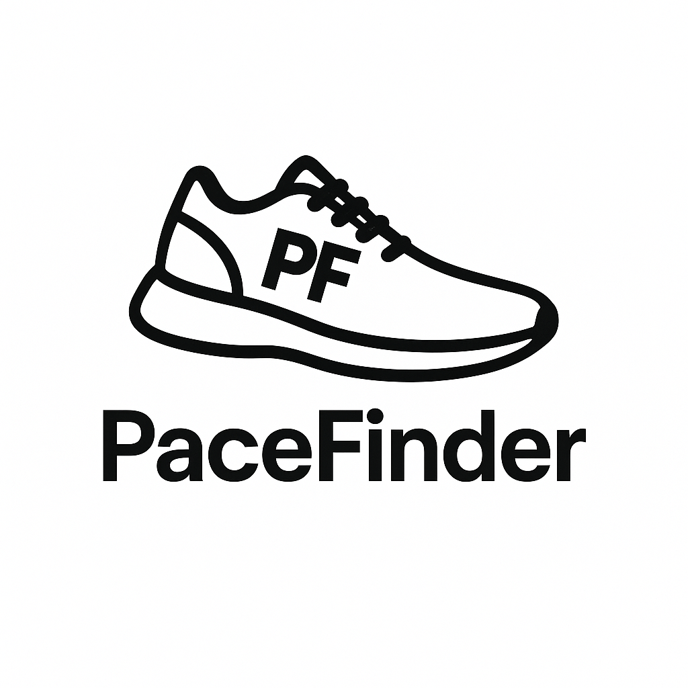
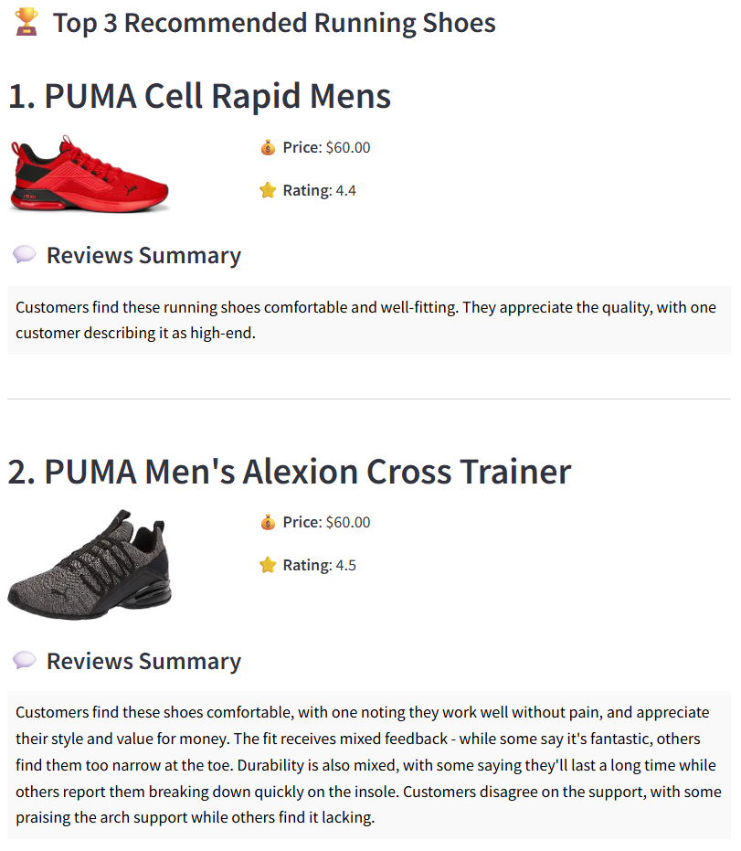

<h3 style="text-align: center;">
  
</h3>

---

<p align="center">
  
</p>
<h1 align="center">
<br>
Your Running Shoes Recommender System
</h1>

Deployment: https://huggingface.co/spaces/waskithag/PaceFinder

**PaceFinder**  adalah aplikasi berbasis data yang dirancang untuk membantu para pelari, khususnya pelari pemula dalam membantu menemukan sepatu lari yang paling sesuai dengan kebutuhan dan preferensi pribadi mereka. Rekomendasi dalam aplikasi ini berbasiskan NLP dari data hasil scraping dari Amazon untuk berbagai merek sepatu populer di Indonesia. Aplikasi ini akan memberikan rekomendasi sepatu yang sesuai dengan kebutuhan dan rekomendasi user, sistem ini juga dapat digunakan oleh toko/brand olahraga untuk dapat meningkatkan experience berbelanja pelanggan dalam menentukan sepatu idealnya.

---

## 📖 Problem Background 

Tren olahraga lari di Indonesia, khususnya di Jakarta, mengalami peningkatkan yang signifikan untuk beberapa tahun terakhir dan telah menjadi salah satu cabang olahraga yang paling populer saat ini. Tercatat ada hampir 80 event lari yang diadakan hanya di bulan Oktober menunjukan lari bukan hanya sekadar olahragan, namun telah menjadi bagian dari gaya hidup masyarakat Indonesia, beberapa event yang diadakan di Jakarta diantaranya adalah Alfamart Run 2025, Jakarta Running Festival, Livin’ by Mandiri RUNFEST Jakarta, Crystalin Run Xperience 2025, dan banyak lainnya. 

Antusiasme dan “FOMO” masyarakat dalam melakukan olahraga ini telah menyebar tidak hanya ke komunitas pelari, namun kepada masyarakat yang ingin memulai gaya hidup sehat dengan olahraga lari. Hal ini tentu meningkatkan kebutuhan akan perlengkapan lari yang nyaman dan fungsional, dan tentu kebutuhan utama yang paling banyak diperlukan adalah sepatu running. Khususnya untuk para pelari pemula, pemilihan sepatu pertama seringkali menjadi momen yang membingungkan karena masih belum ada pengalaman sebelumnya. Belum lagi jika melihat pasaran yang menawarkan banyaknya pilihan sepatu, mulai dari merek, tipe, tingkat bantalan, hingga fitur teknologi terbaru, menyebabkan pemilihan sepatu pertama menjadi semakin rumit. Oleh karena itu dibutuhkan sebuah sistem rekomendasi untuk membantu para pelari khususnya pelari pemula untuk membantu menyederhanakan “experience” pemilihan sepatu yang paling cocok berdasarkan dengan kebutuhan dan karakteristik pribadi.


## 🎯 Objective & User

Proyek ini bertujuan untuk membangun sistem rekomendasi sepatu lari menggunakan pendekatan NLP yang menggunakan data scrapping dari Amazon untuk brand sepatu yang paling popular di Indonesia. Aplikasi ini akan membantu:
*	Runner (khususnya pemula) mendapatkan rekomendasi sepatu yang sesuai dengan profil dan kebutuhannya.
*	Brand atau toko olahraga meningkatkan pengalaman berbelanja pelanggan yang diharapkan dapat meningkatkan penjualan.


## 📦 Data

Dataset yang digunakan dalam project ini diperoleh dari hasil scraping pada sebuah website ecommerce Amazon dengan menggunakan kata kunci *"{brand} running shoes"* untuk brand Nike, Adidas, PUMA, Reebok, dan New Balance. Dataset yang dikumpulkan adalah nama produk, rating, harga, gambar produk, brand, customer say, dan reviews.

Dataset bersih terdiri dari 8 kolom dan 609 baris.

| Index | Nama Kolom | Tipe Data |
| --- | --- | --- |
| 1 | product | String |
| 2 | img_url | String | 
| 3 | customer_say | String |
| 4 | review | String |
| 5 | price | Float |
| 6 | rating | Float |
| 7 | brand | String |
| 8 | gender | String |

## ⚙️ Methods


```
1. Data Acquisition
    ├── Scraping Data
    ├── Data Cleaning
    ├── Data Saving
    └── Data Testing (Great Expectation)

2. Data Analysis
    ├── Data Exploration
    └── Data Visualization

3. Modelling
    ├── Text Pre-processing
    ├── Data Transformation
    ├── Model Definition
    ├── Model Training
    ├── Model Deployment
    └── Model Evaluation

4. Deployment
    ├── Analysis Report
    ├── Model Deployment
    └── Evaluation
```

## 🛠️ Stacks


| No | Stack |
| --- | --- |
| 1 | Python | 
| 2 | Pandas |
| 3 | Numpy |
| 4 | Wordcloud |
| 5 | NLTK |
| 6 | SK-Learn |
| 7 | Streamlit |
| 8 | ScraperAPI |
| 9 | BS4 |
| 10 | VSCode |
| 11 | Hugging Face |

## 🚀 Result
* Aplikasi PaceFinder untuk Rekomendasi Sepatu lari dapat diakses melalui link berikut: \
https://huggingface.co/spaces/waskithag/PaceFinder

Contoh tampilan hasil rekomendasi
<p align="center">
  
</p

* Hasil dari analisis data dapat diakses pada link berikut: \
https://github.com/FTDS-assignment-bay/p2-final-project-pacefinder-rmt-046/blob/main/eda.ipynb

* Materi presentasi project dapat diakses pada link berikut: \
https://docs.google.com/presentation/d/1Hd7haWhrTwkPfDx5ipj8eWtlqA7t0bDKfNtjnyjlOL4/edit?usp=sharing

## 🧠 Project Member
| Nama | Role | Contact |
| --- | --- | --- |
| Marvin Yonathan Hadiyanto | Data Engineer | [marvin.yonathan.hadi@gmail.com](mailto:marvin.yonathan.hadi@gmail.com) |
| Waskitha Ghaziadiyata | Data Scientist | [waskithag@gmail.com](mailto:waskithag@gmail.com) |
| Angelica Zalisca | Data Analyst | [angelica.keraf@gmail.com](mailto:angelica.keraf@gmail.com) |
---

